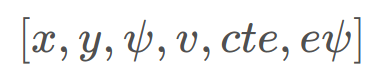
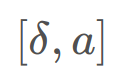

# Model Predictive Control

## The Model

### The kinematic model includes:

- vehicle's position: x,y
- heading angle: psi
- velocity: v
- cross-track error: cte
- psi error: epsi

### Actuators:
 - acceleration: a
 - steering angle: delta

 

### The update equations is shown below:

## The chosen N (timestep length) and dt
- N determines the number of variables optimized by the MPC: If it is too large. such as 100, the simulation would be slower.
- I first Choose the suggested value from Udacity, namely 20/0.05. However the vehich sway from side to side soon. The I tune the value to 10/0.05, it's better, but the vehicle leave the road after a while.
- The finaly value is 10/0.1

## Polynomial Fitting and MPC Preprocessing
A polynomial is fitted to waypoints.The waypoints are transformed from global coordinate to vehich corrdinate so that px = 0, py = 0. And then the calculation could be simlified.(Main.cpp line 71-85)

## Model Predictive Control with Latency

One approach would be running a simulation using the vehicle model starting from the current state for the duration of the latency. The resulting state from the simulation is the new initial state for MPC.

Thus I deal with the latency through predicting 100ms more. (see MPC.cpp line 25-26)